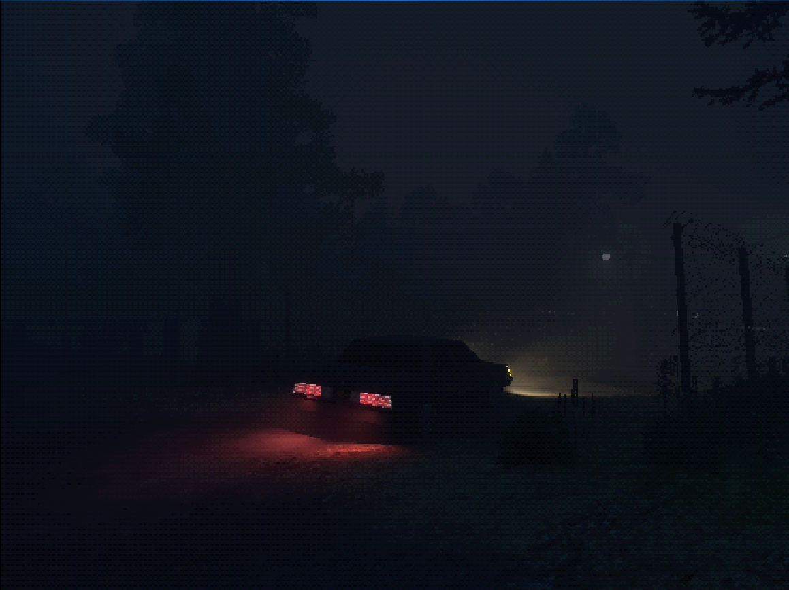
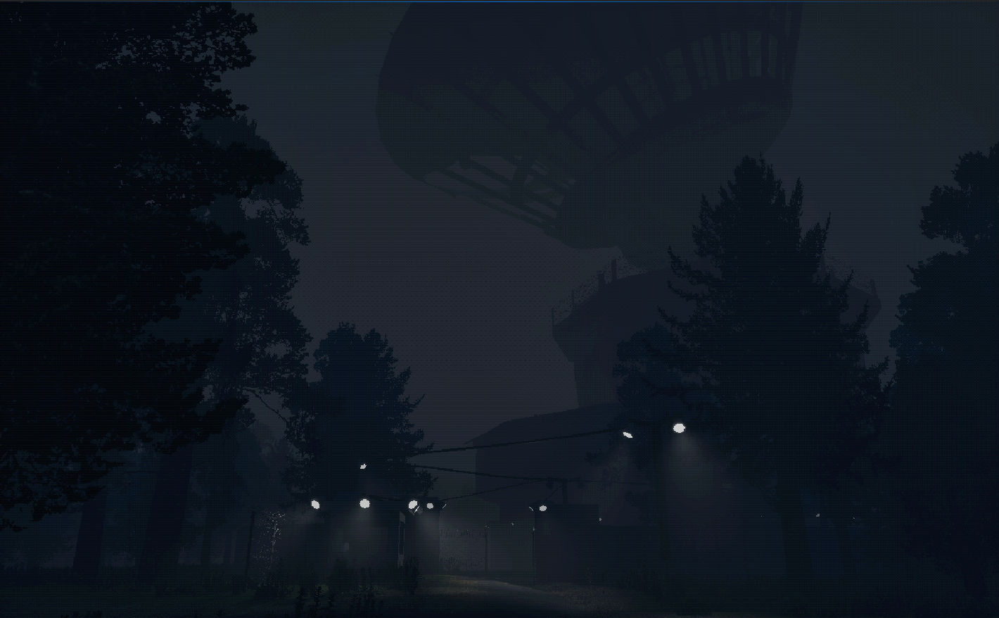

# Envision-Research-Facility-Showcase

First-person psychological horror game developed in Unreal Engine 5.

Steam page:
https://store.steampowered.com/app/4564440/Envision_Research_Facility/

Gameplay video:
https://youtu.be/8EPtJng3KNI?si=2u7_dZpEmDndMW0

## About

Envision Research Facility is a first-person exploration horror game focused on atmosphere, puzzles and environmental storytelling.

The project was developed as an independent game and is planned to be used as my Computer Engineering thesis project.

## Technologies

- Unreal Engine 5
- C++
- Blueprints
- Blender

## Implemented features

- Player interaction system
- Puzzle mechanics
- Audio events
- Level design
- 3D environment creation

## Screenshots

